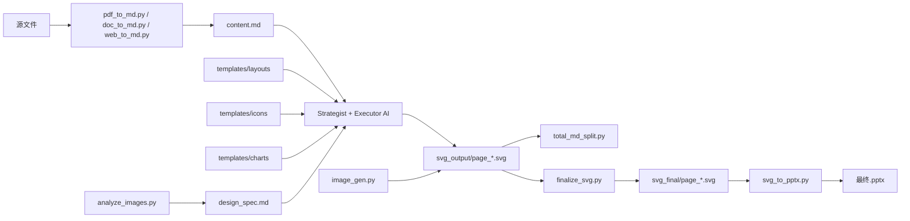

## PPT Master 核心架构梳理

根据你的目录结构和 SKILL.md 内容，我将项目按**功能层次**重新组织，形成清晰的索引。后续你可以按分类分批上传，我们逐一深入解读。

---

### 一、总体分层（从抽象到具体）

| 层级 | 目录 | 作用 |
|------|------|------|
| **流程定义层** | `SKILL.md` | 工作流宪法：阶段划分、角色切换、全局纪律 |
| **角色规范层** | `references/` | 每个 AI 角色的职责、对话模板、设计参数确认规范 |
| **脚本实现层** | `scripts/` | 转换、处理、导出的可执行工具 |
| **模板资源层** | `templates/` | 布局模板、图表模板、图标库、设计规范参考 |
| **独立工作流** | `workflows/` | 特定任务（如创建模板）的独立指南 |
| **示例项目层** | `examples/` | 完整项目样例，展示目录结构和最终输出 |

---

### 二、核心文件分类清单（排除资产类、示例类）

#### 🔷 1. 流程定义层（根目录）
| 文件 | 作用 |
|------|------|
| `SKILL.md` | **核心入口**：6阶段工作流（源处理→项目创建→模板选择→策略师八确认→图片生成→执行师→后处理），全局串行纪律、阻塞点、角色切换协议 |

#### 🔷 2. 角色规范层（`references/`）
| 文件 | 作用 |
|------|------|
| `strategist.md` | 策略师：如何执行“八项确认”（画布、页数、受众、风格、配色、图标、字体、图片），输出设计规范 `design_spec.md` |
| `executor-base.md` | 执行师通用规则：设计参数确认、SVG 生成规范、页面布局约束 |
| `executor-general.md` | 通用灵活风格的执行细则 |
| `executor-consultant.md` | 咨询风格（非 MBB 级）的执行细则 |
| `executor-consultant-top.md` | 顶级咨询风格（MBB 级）的执行细则 |
| `image-generator.md` | 图片生成师：提示词优化、图片生成流程、与设计规范的对接 |
| `template-designer.md` | 模板设计师：如何创建新布局模板（独立工作流也引用） |
| `shared-standards.md` | 全角色共享技术约束：禁止的 SVG 特性、兼容性替代方案 |
| `canvas-formats.md` | 画布格式定义：PPT 16:9（1280x720）、PPT 4:3、小红书、朋友圈等 |
| `image-layout-spec.md` | 图片在 SVG 中的布局规范（尺寸、位置、裁剪） |
| `svg-image-embedding.md` | SVG 中嵌入图片的技术细节（base64、引用方式） |

#### 🔷 3. 脚本实现层（`scripts/`）

##### 3.1 源文件转换
| 脚本 | 作用 |
|------|------|
| `pdf_to_md.py` | PDF → Markdown |
| `doc_to_md.py` | DOCX/EPUB/HTML/LaTeX/RST → Markdown（依赖 Pandoc） |
| `web_to_md.py` | 普通网页 → Markdown（Python） |
| `web_to_md.cjs` | 微信公众号/高安全站点 → Markdown（Node.js） |

##### 3.2 项目管理
| 脚本 | 作用 |
|------|------|
| `project_manager.py` | 项目初始化、导入源文件（--move 移动）、验证项目结构 |
| `project_utils.py` | 项目路径、目录结构、元数据读写的辅助函数 |
| `config.py` | 全局配置（路径、默认参数） |
| `error_helper.py` | 统一的错误处理和日志格式 |

##### 3.3 图片处理
| 脚本 | 作用 |
|------|------|
| `analyze_images.py` | 分析图片尺寸、格式、分辨率，输出 JSON 供设计规范使用 |
| `image_gen.py` | 调用多种后端（Gemini/OpenAI/Qwen 等）生成图片，支持 `--aspect_ratio` `--image_size` |
| `rotate_images.py` | 批量旋转/翻转图片（用于适配布局） |
| `gemini_watermark_remover.py` | 去除 Gemini 生成图片的水印 |
| `image_backends/` 目录 | 各后端的具体实现（`backend_gemini.py`、`backend_openai.py` 等） |

##### 3.4 SVG 后处理流水线（核心三兄弟）
| 脚本 | 作用 |
|------|------|
| `total_md_split.py` | 将总 `content.md` 按页分割为 `notes/page_*.md`（演讲备注） |
| `finalize_svg.py` | **统一入口**：调用 `svg_finalize/` 下的模块，对 `svg_output/` 进行后处理，输出 `svg_final/` |
| `svg_to_pptx.py` | **统一入口**：调用 `svg_to_pptx/` 下的模块，将 `svg_final/` 转换为 PPTX（原生形状 + SVG 参考版） |

##### 3.5 SVG 后处理子模块（`svg_finalize/`）
| 模块 | 作用 |
|------|------|
| `embed_icons.py` | 将 `<use href="#icon-xxx">` 替换为实际图标路径（从模板库复制） |
| `embed_images.py` | 将 `<image href="...">` 中的图片嵌入为 base64 或复制到项目内 |
| `crop_images.py` | 根据 SVG 中定义的裁剪区域裁剪图片 |
| `fix_image_aspect.py` | 调整图片纵横比以匹配 SVG 容器 |
| `flatten_tspan.py` | 将 `<tspan>` 标签扁平化（PPT 兼容性） |
| `svg_rect_to_path.py` | 将 `<rect>` 带圆角的转换为 `<path>`（PPT 兼容） |

##### 3.6 PPTX 导出子模块（`svg_to_pptx/`）
| 模块 | 作用 |
|------|------|
| `pptx_builder.py` | 主构建器：解析 SVG 并调用 python-pptx 生成原生形状 |
| `drawingml_converter.py` | SVG 元素 → DrawingML 元素的核心转换逻辑 |
| `drawingml_elements.py` | DrawingML 元素类（形状、文本框、图片等） |
| `drawingml_paths.py` | 路径数据转换（SVG path → DrawingML path） |
| `drawingml_styles.py` | 样式转换（填充、描边、阴影等） |
| `drawingml_utils.py` | 辅助函数（坐标转换、单位换算） |
| `pptx_cli.py` | 命令行入口处理 |
| `pptx_dimensions.py` | 幻灯片尺寸和坐标计算 |
| `pptx_notes.py` | 演讲备注的嵌入 |
| `pptx_media.py` | 图片、视频等媒体资源处理 |
| `pptx_slide_xml.py` | 直接操作 PPTX 内部 XML 的底层函数 |

##### 3.7 辅助脚本
| 脚本 | 作用 |
|------|------|
| `svg_quality_checker.py` | 检查 SVG 是否符合 PPT 兼容规范（禁止标签、viewBox 等） |
| `batch_validate.py` | 批量验证多个项目的输出 |
| `update_repo.py` | 更新 PPT Master 仓库本身（git pull + 依赖更新） |
| `pptx_animations.py` | 为 PPTX 添加动画（扩展功能） |
| `pptx_template_import.py` | 从现有 PPTX 模板导入样式（高级功能） |
| `svg_position_calculator.py` | 计算 SVG 元素在画布上的精确位置（用于复杂布局） |
| `generate_examples_index.py` | 生成 examples 目录的索引（文档用） |
| `scripts/docs/` 目录 | 各脚本的详细文档（`conversion.md`、`svg-pipeline.md` 等） |

#### 🔷 4. 模板资源层（`templates/`）

| 目录/文件 | 作用 |
|-----------|------|
| `design_spec_reference.md` | 设计规范模板（`design_spec.md` 的格式参考） |
| `layouts/layouts_index.json` | 所有布局模板的索引（名称、风格描述、适用场景） |
| `layouts/<模板名>/` | 每个模板包含 `01_cover.svg`、`02_toc.svg`、`03_content.svg`、`04_ending.svg` 等布局 SVG，以及 `design_spec.md`（该模板的设计规范）和可能的 logo 图片 |
| `charts/charts_index.json` | 图表模板索引（40+ 种图表类型） |
| `charts/*.svg` | 具体图表 SVG 模板（如 `bar_chart.svg`、`line_chart.svg`） |
| `icons/icons_index.json` | 图标库索引（640+ 图标，按名称和分类） |
| `icons/*.svg` | 每个图标单独一个 SVG 文件（如 `heart.svg`、`star.svg`） |

#### 🔷 5. 独立工作流层（`workflows/`）
| 文件 | 作用 |
|------|------|
| `create-template.md` | 如何从零创建一个新模板（布局模板或图表模板） |
| `topic-research.md` | 如何为某个主题做内容研究并生成 PPT 大纲 |

#### 🔷 6. 示例项目层（`examples/`）
> 你已明确排除资产类，此处只列结构

每个示例项目目录包含：
- `sources/`（原始 Markdown）
- `svg_output/`（AI 生成的 SVG）
- `svg_final/`（后处理后的 SVG）
- `images/`（配图）
- `content.md`
- `design_spec.md`
- `*.pptx`

---

### 三、核心数据流（文件间关系）

---

### 四、后续解读计划（按你的分批上传顺序）

1. **SKILL.md** — 已完成
2. **references/** 全部文件（按角色顺序：strategist → executor-base → executor-* → image-generator → shared-standards → 其他）
3. **scripts/** 核心脚本（先转换类 → 项目管理类 → 后处理三兄弟 → 子模块）
4. **templates/** 索引文件（layouts_index.json、charts_index.json、icons_index.json）及设计规范参考
5. **workflows/**（可选）

你可以按上述分类，分批上传文件内容，我会逐行解读并记录学习笔记。
