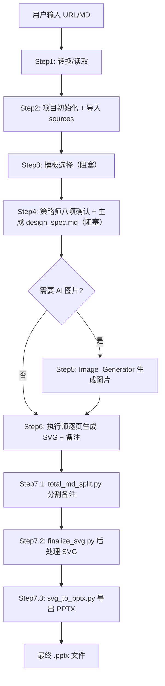

## PPT Master 完整运行流程详解（以网址输入和 Markdown 文件输入为例）

本文档将逐步还原从用户提供源材料到最终生成可编辑 PPTX 的完整过程，涵盖每个阶段的**信息流、业务流、操作流**，并详细说明涉及的脚本、文件、角色、约束和实际命令。两种输入场景（网址、Markdown 文件）在 Step 1 略有差异，后续步骤通用。

> **前置条件**：AI 已加载项目上下文，并已读取 `AGENTS.md` 和 `skills/ppt-master/SKILL.md`。AI 知道自己的角色（策略师、执行师等）以及必须遵守的全局纪律（串行执行、阻塞点、禁止并行等）。

---

## 第一阶段：源内容处理（Step 1）

### 场景 A：用户提供网址

**用户输入示例**：
> 请根据这篇文章制作 PPT：https://mp.weixin.qq.com/s/xxxxxx

**AI 动作**：
1. 检测到输入为 URL，根据 `SKILL.md` Step 1 的指引，需要将网页转换为 Markdown。
2. 判断网址是否为微信公众号（`mp.weixin.qq.com`）。若是，则使用 Node.js 脚本 `web_to_md.cjs`；否则使用 Python 脚本 `web_to_md.py`。
3. **执行转换**（AI 运行命令）：

```bash
# 假设是微信公众号
node skills/ppt-master/scripts/web_to_md.cjs "https://mp.weixin.qq.com/s/xxxxxx"
```

该脚本会：
- 使用 Puppeteer（或类似）抓取动态内容。
- 提取正文、标题、发布时间、作者等元数据。
- 下载页面中的图片到本地 `_files` 目录。
- 输出一个 Markdown 文件（默认保存在当前目录或 `projects/` 下，文件名基于 URL 生成，如 `wechat_article_xxxx.md`）。

4. **输出文件**：
   - `wechat_article_xxxx.md`（Markdown 内容）
   - `wechat_article_xxxx_files/`（包含下载的图片）

5. **AI 确认**：输出 checkpoint 消息，表示源内容已就绪，进入 Step 2。

> **约束**：AI 不能直接打开或分析图片文件，只能通过脚本输出或设计规范中的图片资源列表处理。

### 场景 B：用户提供 Markdown 文件

**用户输入示例**：
> 我有一份 Markdown 文件 `report.md`，请根据它制作 PPT。

**AI 动作**：
1. 检测输入为本地 Markdown 文件（`.md` 扩展名）。
2. 根据 `SKILL.md`，Markdown 文件可以直接读取，无需转换。
3. **AI 记录文件路径**，准备在 Step 2 中导入。
4. 输出 checkpoint 消息，进入 Step 2。

> **注意**：如果 Markdown 文件引用了本地图片（如 ``），这些图片需要一同保留，并在后续步骤中通过 `import-sources` 处理。

---

## 第二阶段：项目初始化（Step 2）

无论输入类型，此步骤通用。

**AI 动作**：
1. **创建项目目录**（使用 `project_manager.py init`）：

```bash
python3 skills/ppt-master/scripts/project_manager.py init my_ppt --format ppt169
```

- 项目名称：`my_ppt`（可自定义）
- 画布格式：`ppt169`（16:9，最常用）。其他格式可选：`ppt43`, `xiaohongshu` 等。
- 命令会在 `projects/` 下创建目录：`projects/my_ppt_ppt169_YYYYMMDD/`

**生成的项目结构**：
```
projects/my_ppt_ppt169_20251201/
├── README.md
├── svg_output/
├── svg_final/
├── images/
├── notes/
├── templates/
└── sources/
```

2. **导入源材料**（使用 `project_manager.py import-sources`）：

```bash
# 网址场景：假设转换后的 Markdown 文件为 wechat_article_xxxx.md
python3 skills/ppt-master/scripts/project_manager.py import-sources projects/my_ppt_ppt169_20251201 wechat_article_xxxx.md --move

# Markdown 文件场景：直接导入用户提供的 report.md
python3 skills/ppt-master/scripts/project_manager.py import-sources projects/my_ppt_ppt169_20251201 report.md --move
```

- `--move` 参数将源文件**移动**到项目的 `sources/` 目录（而不是复制），保持项目自包含。
- 如果源文件带有 `_files` 资产目录（如网页下载的图片），也会一并移动，并自动修正 Markdown 中的图片引用路径。
- 导入后，项目 `sources/` 下会包含一个 Markdown 文件（如 `wechat_article_xxxx.md`）和可能的资产目录。

3. **AI 验证**：检查项目目录是否创建成功，`sources/` 是否包含源材料。输出 checkpoint，进入 Step 3。

---

## 第三阶段：模板选择（Step 3）

**阻塞点 ⛔**：如果用户尚未明确是否使用模板，AI 必须提供选项并等待用户确认。

**AI 动作**：
1. 查询全局模板索引 `skills/ppt-master/templates/layouts/layouts_index.json`，了解可用模板及其风格描述。
2. 根据源内容主题（AI 已从 Markdown 中初步分析），给出专业推荐：

```markdown
💡 **AI Recommendation**: Based on your content about [topic], I recommend the **google_style** template because it features clean tech aesthetics and data-friendly layouts.

Which approach would you prefer?
**A) Use an existing template** (please specify template name or style preference)
**B) No template** — free design
```

3. 用户回复选择（例如：“A，使用 google_style”）。
4. AI 执行模板复制命令：

```bash
cp skills/ppt-master/templates/layouts/google_style/*.svg projects/my_ppt_ppt169_20251201/templates/
cp skills/ppt-master/templates/layouts/google_style/design_spec.md projects/my_ppt_ppt169_20251201/templates/
cp skills/ppt-master/templates/layouts/google_style/*.png projects/my_ppt_ppt169_20251201/images/ 2>/dev/null || true
```

- 模板文件（`01_cover.svg`, `02_chapter.svg`, `03_content.svg`, `04_ending.svg`, 可选的 `02_toc.svg`）被复制到项目的 `templates/` 目录。
- 模板的 `design_spec.md`（设计规范）也被复制，后续策略师会基于它输出最终的设计规范。
- 模板自带的图片（如 logo）被复制到项目的 `images/` 目录。

5. 输出 checkpoint，进入 Step 4。

> **约束**：如果用户已说过“不使用模板”，AI 应跳过此步骤直接进入 Step 4，避免不必要的查询。

---

## 第四阶段：策略师八项确认与设计规范输出（Step 4）

**阻塞点 ⛔**：AI 必须将八项确认作为打包建议呈现给用户，并等待用户明确确认或修改。

**AI 动作**：
1. 切换到策略师角色（输出角色切换标记）。
2. 读取 `references/strategist.md` 和 `templates/design_spec_reference.md`。
3. 分析源 Markdown 内容，生成八项确认建议：

| 序号 | 项目 | 示例建议 |
|------|------|----------|
| a | 画布格式 | PPT 16:9（1280×720） |
| b | 页数范围 | 8-10 页 |
| c | 目标受众 | 高管、投资者 |
| d | 风格目标 | C) 顶级咨询型（结论先行、数据驱动） |
| e | 配色方案 | 主色 `#005587`（麦肯锡蓝），辅色 `#0076A8`，强调色 `#F5A623` |
| f | 图标使用 | C) 内置图标库（推荐） |
| g | 字体方案 | P1（微软雅黑 / Arial，正文 24px 宽松密度） |
| h | 图片使用 | C) AI 生成（如果需要配图） |

4. 如果用户提供了图片（在 `images/` 目录），先运行 `analyze_images.py` 分析图片，将结果纳入建议。
5. **向用户展示打包的建议**，等待确认。用户可修改任何一项。
6. 用户确认后，AI 生成完整的设计规范文件 `design_spec.md`，保存到项目根目录。
7. 输出 checkpoint，进入 Step 5（如果需要 AI 生成图片）或直接进入 Step 6。

**生成的设计规范包含 13 个章节**：
- I. 项目信息
- II. 画布规范
- III. 视觉主题（配色方案、渐变）
- IV. 字体系统（字体栈、字号层级）
- V. 布局原则（页面结构、布局模式、间距）
- VI. 图标使用规范（推荐图标列表）
- VII. 图表参考列表（如果需要）
- VIII. 图片资源清单（状态：待生成/已存在/占位符）
- IX. 内容大纲（每页的布局、标题、要点、图表类型）
- X. 演讲备注要求
- XI. 技术约束提醒
- XII. 设计检查清单
- XIII. 后续步骤

---

## 第五阶段：图片生成（Step 5，条件性）

**触发条件**：设计规范中的图片使用方式包含“C) AI 生成”。

**AI 动作**：
1. 切换到图片生成师角色，读取 `references/image-generator.md`。
2. 从设计规范的“VIII. 图片资源清单”中提取所有状态为“待生成”的图片。
3. 为每张图片生成优化后的提示词，创建 `project/images/image_prompts.md` 文件。
4. **调用 `image_gen.py`** 生成图片（以 Gemini 后端为例）：

```bash
# 设置环境变量（可从 .env 加载）
export IMAGE_BACKEND=gemini
export GEMINI_API_KEY=your_key

python3 skills/ppt-master/scripts/image_gen.py "Abstract tech background, deep blue gradient, 16:9, high resolution" --aspect_ratio 16:9 --image_size 1K -o projects/my_ppt_ppt169_20251201/images --filename cover_bg
```

- 生成的图片保存到 `images/` 目录，文件名与资源清单一致。
5. 更新资源清单状态为“已生成”。
6. 输出 checkpoint，进入 Step 6。

---

## 第六阶段：执行师生成 SVG 和演讲备注（Step 6）

**约束**：
- SVG 生成必须由当前主代理完成，**不能委托给子代理**。
- 必须一页一页顺序生成，**不能分组批量生成**。
- 必须先锁定全局设计参数，再逐页生成。

**AI 动作**：
1. 切换到执行师角色，读取 `references/executor-base.md` 和对应的风格文件（如 `executor-consultant-top.md`）。
2. **设计参数确认**：输出关键参数（画布尺寸、正文字号、配色方案、字体计划），确保与设计规范一致。
3. **视觉构建阶段**：按顺序为每一页生成 SVG：
   - 读取设计规范中的内容大纲，了解每页的布局、标题、要点。
   - 如果有模板，参考项目 `templates/` 下的对应 SVG（如 `01_cover.svg`），继承背景、页眉页脚，替换占位符（`{{TITLE}}` 等）。
   - 如果是自由设计，根据布局原则从零构建 SVG。
   - 在 SVG 中使用 `<use data-icon="...">` 引用图标库中的图标（如 `<use data-icon="chart-bar" x="100" y="200" width="48" height="48" fill="#005587"/>`）。
   - 将生成的 SVG 保存到 `svg_output/`，文件名如 `01_cover.svg`, `02_overview.svg` 等。
4. **逻辑构建阶段**：所有 SVG 生成后，生成完整的演讲备注文档 `notes/total.md`。
   - 每页以 `# 01_cover` 开头（标题与 SVG 文件名匹配）。
   - 内容为演讲脚本，包含 `[过渡]`, `[停顿]`, `[数据]` 等舞台指示标记。
   - 每页结束后用 `---` 分隔。
5. 输出 checkpoint，进入 Step 7。

**生成的示例文件**：
- `svg_output/01_cover.svg`
- `svg_output/02_background.svg`
- ...
- `notes/total.md`

---

## 第七阶段：后处理与导出（Step 7）

**约束**：三个子步骤必须**逐个单独执行**，每个完成后确认无误才能运行下一个。

### Step 7.1：分割演讲备注

```bash
python3 skills/ppt-master/scripts/total_md_split.py projects/my_ppt_ppt169_20251201
```

- 读取 `notes/total.md`，根据一级标题和 `---` 分隔符，将每个页面的备注分割成独立文件。
- 生成 `notes/01_cover.md`, `notes/02_background.md` 等。
- **验证**：确保每个 SVG 文件都有对应的备注文件，否则报错。

### Step 7.2：SVG 后处理

```bash
python3 skills/ppt-master/scripts/finalize_svg.py projects/my_ppt_ppt169_20251201
```

- 该脚本依次调用 `svg_finalize/` 下的子模块：
  1. **embed_icons.py**：将 `<use data-icon="...">` 替换为实际图标 SVG 路径（从 `templates/icons/` 读取），并应用缩放和颜色。
  2. **crop_images.py**：根据 `preserveAspectRatio="slice"` 智能裁剪图片，保存到 `images/cropped/`，更新 SVG 引用。
  3. **fix_image_aspect.py**：修正图片宽高比，防止 PPT 转换时拉伸，调整 `image` 元素的 `x`, `y`, `width`, `height`。
  4. **embed_images.py**：将外部图片引用转为 Base64 内嵌（可选，默认执行）。
  5. **flatten_tspan.py**：将 `<tspan>` 多行文本扁平化为独立的 `<text>` 元素。
  6. **svg_rect_to_path.py**：将 `<rect rx="...">` 转换为 `<path>` 圆弧，保证圆角在 PPT 中保留。
- 处理后的 SVG 保存在 `svg_final/` 目录。

### Step 7.3：导出 PPTX

```bash
python3 skills/ppt-master/scripts/svg_to_pptx.py projects/my_ppt_ppt169_20251201 -s final
```

- 该脚本使用 `svg_to_pptx/` 包中的模块：
  - 解析 `svg_final/` 下的所有 SVG 文件。
  - 使用 `drawingml_converter.py` 将 SVG 元素转换为 DrawingML 形状（`<p:sp>`, `<p:pic>` 等）。
  - 收集媒体文件（图片）和关系条目。
  - 使用 `python-pptx` 创建空白 PPTX，然后替换幻灯片内容。
  - 嵌入演讲备注（从 `notes/*.md` 读取）。
  - 生成两个文件：
    - `my_ppt_ppt169_20251201_YYYYMMDD_HHMMSS.pptx`：原生形状版（可编辑）。
    - `my_ppt_ppt169_20251201_YYYYMMDD_HHMMSS_svg.pptx`：SVG 参考版（图片形式）。
- 输出最终文件路径和统计信息。

---

## 信息流与业务流总结



**关键文件流转**：
- 源文件 → `sources/*.md` + `sources/*_files/`
- 设计规范 → `design_spec.md`
- 图片 → `images/`（原始），`images/cropped/`（裁剪后）
- SVG → `svg_output/`（原始），`svg_final/`（后处理）
- 备注 → `notes/total.md`（完整），`notes/*.md`（分割）
- PPTX → 项目根目录

**每个阶段的约束检查点**：
- Step 1: 确保转换成功，Markdown 可读。
- Step 2: 确保项目目录结构完整，`sources/` 包含材料。
- Step 3: 用户必须明确选择模板或自由设计。
- Step 4: 用户必须确认八项建议。
- Step 5: 图片生成后必须验证文件存在。
- Step 6: 逐页生成，不得并行或委托子代理。
- Step 7: 三步必须串行执行，每步成功后继续。

通过以上完整流程，PPT Master 将任何输入转化为符合设计规范、技术兼容且可编辑的 PowerPoint 文件。