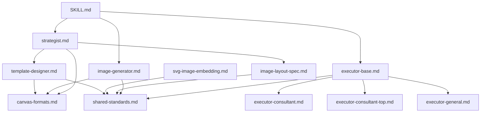

## references/ 目录整体总结：设计、思路与架构（编码专业角度）

`references/` 目录是 PPT Master 的“知识中枢”。它不包含可执行代码，而是定义了 **AI 角色的行为规范、技术约束、设计原则和协作协议**。从编码专业角度看，这套 reference 文件的设计体现了以下核心思想：

---

### 一、总体设计哲学：规则驱动 + 角色分离 + 约束显式化

| 设计原则 | 体现 |
|----------|------|
| **关注点分离** | 策略师、执行师、图片生成师、模板设计师各司其职，每个角色有独立的 `.md` 文件，职责边界清晰 |
| **声明式约束** | 所有技术限制（SVG 禁用特性、宽高比、布局公式）都以**白名单/黑名单**形式明文列出，AI 无需推断 |
| **模板化输出** | 每个角色的输出格式都有严格的 Markdown 模板（如八项确认、设计规范的 13 个章节、提示词的标准格式），确保下游可解析 |
| **防御性设计** | 明确禁止某些做法（如 `<g opacity>`、`marker-end`、分组批量生成 SVG），并给出替代方案，防止 PPT 兼容性故障 |
| **渐进式细化** | 从宏观（策略师的设计规范）到微观（执行师的 SVG 元素级写法），逐层细化约束 |

---

### 二、核心架构：三层规范体系

```
┌─────────────────────────────────────────────────────────────┐
│  Layer 1: 流程与角色规范 (strategist, executor-*, image-*)  │
│  - 定义每个角色的输入、输出、触发条件、确认点                │
│  - 规定角色切换协议和对话模板                                │
├─────────────────────────────────────────────────────────────┤
│  Layer 2: 技术约束与兼容性 (shared-standards, canvas-*)     │
│  - SVG 禁用特性黑名单 + PPT 兼容替代                        │
│  - 画布尺寸、viewBox、布局计算公式                          │
│  - 后处理流水线固定步骤                                     │
├─────────────────────────────────────────────────────────────┤
│  Layer 3: 专项指南 (image-layout-spec, svg-image-embedding) │
│  - 图片布局的动态计算算法                                   │
│  - 图片引用与嵌入的技术细节                                 │
└─────────────────────────────────────────────────────────────┘
```

这三层不是孤立文件，而是通过交叉引用（如 executor-base.md 引用 shared-standards.md）形成依赖网络，确保任何角色都能获取完整上下文。

---

### 三、关键设计亮点（从编码角度值得借鉴）

#### 1. **阻塞点（BLOCKING）与门禁（GATE）机制**
- 在 strategist.md 和 SKILL.md 中明确定义了哪些步骤必须等待用户确认（如八项确认、模板选择）。
- 这相当于工作流中的**同步屏障**，防止 AI 自作主张跳过关键决策。
- **编码类比**：类似状态机中的 `wait_for_user_input` 状态，或 BPMN 中的用户任务。

#### 2. **数据驱动的布局计算**
- image-layout-spec.md 给出了基于图片宽高比的**确定性公式**（如 `图片高度 = 1160 / R`），而不是依赖 AI 的视觉直觉。
- 这种**将设计规则算法化**的做法，极大降低了 AI 产生不合理布局的概率。
- **编码类比**：类似于 CSS 的 `aspect-ratio` 配合 `calc()`，但这里显式写成了人类可读的数学公式，AI 可直接转换为 SVG 坐标。

#### 3. **占位符契约（Placeholder Contract）**
- template-designer.md 定义了一套标准的占位符（`{{TITLE}}`, `{{CONTENT_AREA}}` 等），使得模板与内容分离。
- 执行师只需替换占位符，无需重新设计布局。
- **编码类比**：类似模板引擎（Jinja2、Mustache）的变量替换，但占位符语义与 PPT 页面类型强绑定。

#### 4. **提示词工程标准化**
- image-generator.md 将提示词拆分为固定组件（主题、风格、色彩、构图、质量、负向提示），并针对 5 种图片类型提供独立模板。
- 这种做法使 AI 生成的提示词**可预测、可调试、可复用**。
- **编码类比**：类似工厂模式（Factory Pattern）——根据图片类型（背景/摄影/插画/图示/装饰）返回不同的提示词构建器。

#### 5. **后处理流水线的强制顺序**
- shared-standards.md 明确规定三步后处理（`total_md_split.py` → `finalize_svg.py` → `svg_to_pptx.py`）必须**串行执行，禁止批量**。
- 这避免了并发文件操作冲突，也确保每个中间产物（`svg_final/`）的完整性。
- **编码类比**：类似 Makefile 中的依赖链，或者 CI/CD 流水线中每个 stage 必须成功才能进入下一个。

#### 6. **错误预防而非错误恢复**
- 很多规则是**禁止性**的（如禁止 `clipPath`、禁止 `<g opacity>`），而不是事后修复。
- 这体现了“**约束内化**”思想：让 AI 从一开始就生成符合 PPT 规范的 SVG，而不是依赖后期脚本打补丁。
- **编码类比**：类似类型系统中的 `never` 类型，或编译器中的静态检查。

---

### 四、文件间的依赖关系图（从引用关系看）



- `shared-standards.md` 是**被引用最多的基础文件**，几乎所有其他文件都依赖它。
- `canvas-formats.md` 是第二基础，定义坐标系统。
- 执行师系列文件（`executor-*.md`）都继承 `executor-base.md`，形成**继承层次**。
- `image-generator.md` 和 `image-layout-spec.md` 通过 `shared-standards.md` 间接关联，但无直接依赖。

---

### 五、值得注意的工程智慧

| 现象 | 背后考量 |
|------|----------|
| 为何禁止 `<g opacity>` 而要求每个子元素单独设 opacity？ | PPT 的 DrawingML 不支持组透明度，但支持每个形状的透明度。单独设置可以无损转换。 |
| 为何禁止 `marker-end` 而要求用 `<polygon>` 画箭头？ | PPT 的 `<a:ln>` 不支持 `marker`，但支持任意多边形。 |
| 为何强制使用 `preserveAspectRatio="xMidYMid slice"` 而非 `meet`？ | 背景图片通常需要铺满，裁剪边缘比留白更符合设计预期。 |
| 为何要求图片布局必须根据宽高比动态计算，而不是固定比例？ | 避免图片变形或裁剪关键内容，确保用户提供的图片能被合理展示。 |
| 为何要求演讲备注中的舞台指示标记（`[Pause]` 等）必须本地化？ | 多语言场景下，AI 容易混用中英文标记，导致备注难以阅读。强制本地化保证一致性。 |

---

### 六、可复用模式（供其他 AI 项目参考）

1. **角色定义文件 + 角色切换协议**：每个角色一个 `.md`，并规定切换时输出固定格式的标记（`[Role Switch: xxx]`）。这使多角色 AI 对话可追踪、可调试。

2. **BLOCKING 标记 + 等待用户确认**：在文本中嵌入特殊标记（⛔ BLOCKING），AI 解析后可自动暂停。这比依赖外部状态机更轻量。

3. **技术约束的黑白名单**：使用表格形式列出“禁用特性”和“正确替代”，AI 容易遵循且不易遗漏。

4. **占位符驱动的模板系统**：用 `{{VAR}}` 标记可替换内容，并定义一套标准占位符集。这简化了模板复用，也减少了 AI 的自由发挥空间。

5. **分层式规范引用**：`executor-base.md` 定义通用规则，`executor-consultant.md` 只写差异。这符合 DRY 原则，也便于扩展新风格。

---

### 七、潜在改进点（个人观察）

1. **缺少显式的版本控制**：目前所有规范没有版本号或变更日志，未来更新时 AI 可能混淆旧规则。
2. **部分公式可参数化**：`image-layout-spec.md` 中的阈值（1.5、2.0 等）是硬编码，但不同行业/风格可能有不同偏好，或许可提取为配置。
3. **角色切换标记未强制校验**：虽然规定输出 `[Role Switch: xxx]`，但没有自动化校验工具，AI 可能遗漏。
4. **`shared-standards.md` 过于庞大**：包含 SVG 约束、后处理、阴影、渐变、旋转等，或许可拆分为 `svg-syntax.md`、`post-processing.md`、`visual-effects.md`。

---

### 八、总结

`references/` 目录本质上是一套 **AI 可执行的领域特定语言（DSL）**，用自然语言书写，但具有高度结构化和确定性。它成功地将演示文稿设计的专业知识（排版、配色、布局、图表、图片处理）转化为 AI 可遵循的规则，使得一个通用大模型能够胜任专业 PPT 生成任务。

从编码专业角度看，这套规范体现了**防御式设计**（提前禁止错误用法）、**契约式编程**（明确定义输入输出格式）、**模板方法模式**（executor-base 定义骨架，子风格实现细节）、**策略模式**（三种咨询风格可插拔）。它值得作为构建“AI 智能体协作系统”的参考范例。